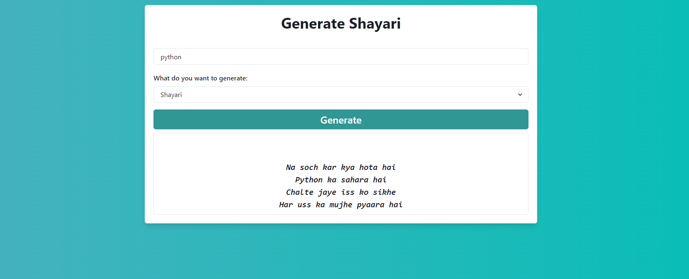
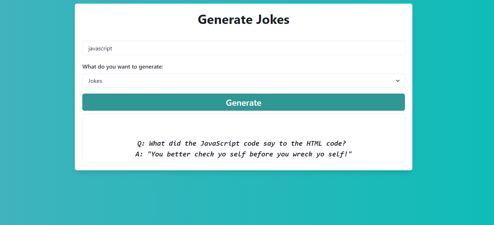

# Shayari Generation Web Application

This repository contains the code for the Shayari Generation web application. The application allows users to generate Shayari, Jokes, Stories, and Quotes based on keywords. It consists of both frontend and backend components.

## Prerequisites

- Node.js (v12 or higher)

## Getting Started

1. Clone the repository:
    ```
    git clone https://github.com/mohitsvp/AI-Shayari-app.git
    cd shayari-generation
    ```


2. Install dependencies for both frontend and backend:

    ```
    cd frontend
    npm install
    cd ../backend
    npm install
    ```


3. Set up environment variables for the backend:

    Create a `.env` file in the `backend` folder and provide your OpenAI API key:

    ```
    OPENAI_API_KEY=your_openai_api_key_here
    PORT=8000
    ```

    Replace `your_openai_api_key_here` with your actual OpenAI API key.

4. Start the frontend development server:

    ```
    cd frontend
    npm start
    ```

    The frontend will run on `https://ai-content-generation.vercel.app/`.

5. Start the backend server:

    ```
    cd backend
    npm start
    ```


    The backend will run on `http://localhost:8000`.

## Frontend

The frontend is built using React.js and Chakra UI for the user interface. It communicates with the backend API to generate content based on user-provided keywords.



## Backend

The backend is built using Express.js and interacts with the OpenAI API to generate Shayari, Jokes, Stories, and Quotes based on user-provided keywords.

## Deployed URL

The web application is deployed at: [https://ai-content-generation.vercel.app/](https://ai-content-generation.vercel.app/)

## Dependencies

### Frontend

- react: JavaScript library for building user interfaces
- react-dom: Integration of React with the DOM
- axios: Promise-based HTTP client for making API requests
- @chakra-ui/react: UI component library for React
- framer-motion: Library for animations in React

### Backend

- express: Web framework for Node.js
- dotenv: Load environment variables from `.env` file
- cors: Enable Cross-Origin Resource Sharing (CORS)
- openai: Official OpenAI GPT-3 API library

## How to Use

1. The application allows users to generate Shayari, Jokes, Stories, or Quotes based on a keyword.

2. Enter a keyword in the "Enter Text" input field.

3. Select the type of content you want to generate from the dropdown menu.

4. Click on the "Generate" button.

5. The generated content will be displayed below the button.

6. If there is an error while generating the content, an error message will be shown.



## Contributing

If you find any issues or have suggestions for improvement, feel free to open an issue or submit a pull request.

## License

This project is licensed under the MIT License - see the LICENSE for details.


